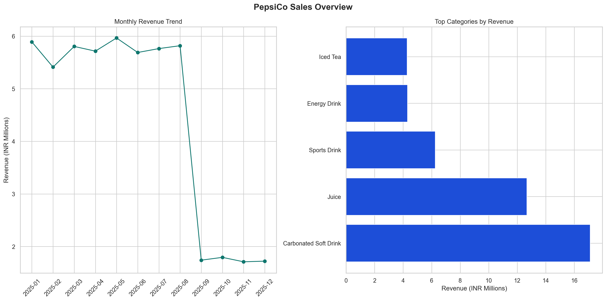

# PepsiCo Sales Performance & Business Insights Analysis

## Business Problem

Commercial teams need more than topline sales numbers. They need to know which categories are carrying the business, which states deserve incremental investment, whether order-value mix is improving, and how recent demand signals should influence planning. This project converts order-level sales data into a leadership-ready growth and performance review.

## Objective

Build an end-to-end sales analytics workflow that:

- resolves a local-only workbook without pushing it to GitHub
- standardizes sales data and date features
- measures category, geography, and value-band performance
- adds monthly trend analysis, anomaly flags, and a simple forecast baseline

## Dataset Strategy

- Full workbook: stored locally in `data/raw/` and excluded from GitHub
- GitHub-safe sample: `data/sample/pepsico_sales_sample.csv`
- Processed outputs: written to `data/processed/`
- Automated ingestion options:
  - local path via `PEPSICO_DATA_PATH`
  - Google Drive via `data/data_sources.json`
  - Kaggle via `data/data_sources.json`
  - sample fallback for GitHub reviewers

## Project Structure

```text
PepsiCo Sales Performance & Business Insights Analysis/
├── assets/
├── dashboard/
├── data/
│   ├── raw/
│   ├── sample/
│   └── processed/
├── notebooks/
├── reports/
├── scripts/
│   └── sql/
├── README.md
└── requirements.txt
```

## Methodology

1. Bootstrap the raw workbook from local storage, Google Drive, Kaggle, or sample data.
2. Standardize columns and engineer month, quarter, and day-level fields.
3. Segment transactions into `Budget`, `Core`, `Premium`, and `Enterprise` order-value bands.
4. Build KPI, category, state, and value-band summaries.
5. Create monthly trend outputs with anomaly checks and a baseline 3-period revenue forecast.
6. Export processed data and dashboard-ready assets for recruiter review.

## KPIs Used

- Total Revenue
- Total Orders
- Average Order Value
- Average Rating
- Top Category
- Top Product
- Top State
- Revenue by Value Band
- Monthly Revenue Trend
- Forecast Revenue Baseline

## Key Insights

- The dataset contains **197,430 orders** and **INR 53.01M** in revenue.
- `Carbonated Soft Drink` and `Juice` together generate **INR 29.79M**, or roughly **56.2%** of revenue.
- `Karnataka` is the lead state with **INR 5.46M**, contributing **10.29%** of total revenue.
- `Premium` and `Enterprise` orders contribute **INR 36.01M**, or about **67.9%** of the revenue mix.
- The business peaks in **May 2025** at **INR 5.96M**, while the baseline forecast softens materially into early 2026, signalling the need for active demand planning.

## Business Recommendations

- Protect the highest-revenue categories and products with stronger distributor execution and inventory planning.
- Use Karnataka as a benchmark market and selectively replicate its execution model into second-tier states.
- Push order-value mix upward by converting `Core` orders into `Premium` bundles, distributor incentives, or channel offers.

## Measurable Business Impact

If PepsiCo shifts **5%** of current `Core` revenue into `Premium` pricing or mix, it would create approximately **INR 752K** in higher-value revenue.

## Dashboard Screenshot



## How To Run

### 1. Install dependencies

```bash
python3 -m pip install -r requirements.txt
```

### 2. Choose a data path

Option A: use the full local workbook

```bash
python3 scripts/bootstrap_data.py
```

Option B: configure Google Drive or Kaggle

```bash
cp data/data_sources.example.json data/data_sources.json
python3 scripts/bootstrap_data.py
```

Option C: use the GitHub-safe sample

```bash
python3 scripts/pepsico_sales_performance_analysis.py --use-sample
```

### 3. Run the full workflow

```bash
python3 scripts/run_pipeline.py
```

### 4. Export recruiter-facing chart assets

```bash
python3 scripts/export_dashboard_assets.py
```

## Main Outputs

- `data/processed/pepsico_sales_cleaned.csv`
- `data/processed/pepsico_monthly_summary.csv`
- `data/processed/pepsico_revenue_forecast.csv`
- `data/processed/pepsico_category_summary.csv`
- `data/processed/pepsico_state_summary.csv`
- `data/processed/pepsico_value_band_summary.csv`

## Why This Project Is Portfolio-Ready

- Balances business storytelling with reusable analysis outputs.
- Solves the GitHub large-file issue without uploading the full workbook.
- Includes trend analysis, order-value segmentation, forecast baseline, and recruiter-facing visuals.
